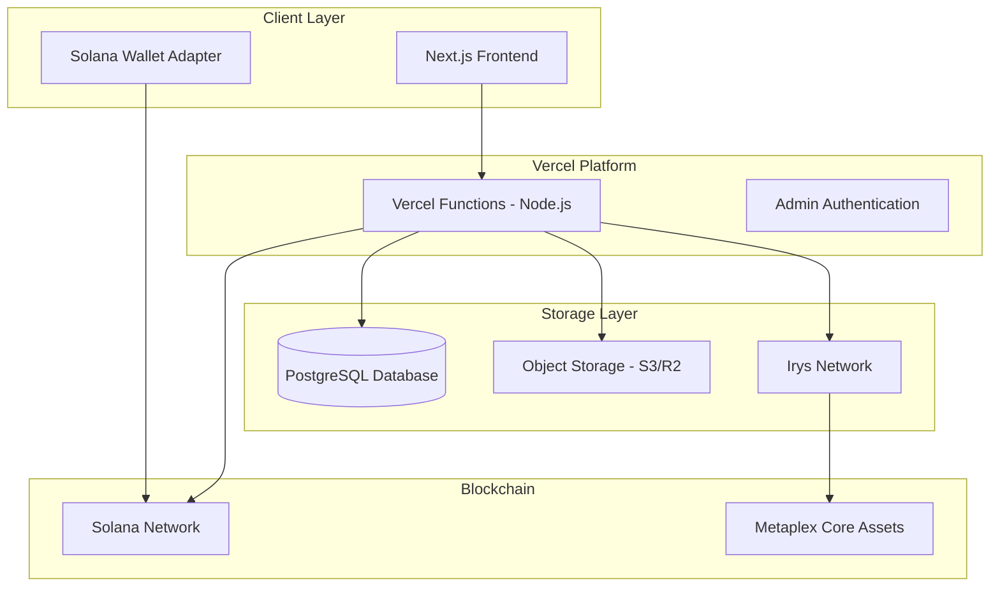

# Design Document

## Overview

The NFT Trait Marketplace is a full-stack web application built on Vercel that enables secure trait commerce for Metaplex Core NFTs. The system uses atomic transactions to combine payments with NFT updates, ensuring users cannot lose money without receiving their trait updates. The architecture leverages Next.js for the frontend, Vercel Functions with Node.js runtime for backend operations, PostgreSQL for authoritative state, and Irys for immutable metadata storage.

## Architecture

### High-Level Architecture



### Technology Stack

- **Frontend**: Next.js 14 with TypeScript, Tailwind CSS, Solana Wallet Adapter
- **Backend**: Vercel Functions with Node.js runtime for signing and image composition
- **Database**: PostgreSQL (Neon/Supabase) for authoritative state
- **Storage**: S3/Cloudflare R2 for admin uploads, Irys for immutable metadata
- **Blockchain**: Solana with Metaplex Core SDK (@metaplex-foundation/mpl-core)
- **Authentication**: Session-based auth with Argon2id hashing and TOTP MFA

## Components and Interfaces

### Frontend Components

#### Wallet Connection Module
- Integrates Solana Wallet Adapter for multi-wallet support
- Handles connection state and wallet switching
- Provides wallet context throughout the application

#### NFT Gallery Component
- Fetches and displays user's Core NFTs from allowlisted collections only
- Filters NFTs to show only those belonging to admin-configured collection IDs
- Provides NFT selection interface with metadata display

#### Trait Store Component
- Displays available traits organized by slot and rarity (visible before wallet connection)
- Shows pricing, supply, and availability status for all traits
- Integrates gift balance display for eligible wallets after connection

#### Preview Renderer
- Client-side image composition using HTML5 Canvas
- Layers trait images according to slot order configuration
- Validates trait combinations against rule constraints
- Provides real-time preview updates

#### Admin Dashboard
- Project settings management interface
- Trait creation and management tools
- Analytics dashboard with charts and metrics
- Audit log viewer with filtering capabilities

### Backend API Interfaces

#### Public API Endpoints
```typescript
// Project configuration
GET /api/project -> ProjectConfig

// Trait catalog
GET /api/traits?slot=&rarity=&token=&active=1 -> Trait[]

// User NFTs
GET /api/user/nfts?wallet=address -> CoreAsset[]

// Purchase flow
POST /api/reserve -> ReservationResponse
POST /api/tx/build -> PartiallySignedTransaction
POST /api/tx/confirm -> TransactionStatus

// Gift balances
GET /api/gifts?wallet=address -> GiftBalance[]
```

#### Admin API Endpoints
```typescript
// Authentication
POST /api/admin/login -> AuthSession
POST /api/admin/mfa/verify -> MFAResult

// Management
CRUD /api/admin/traits -> Trait
CRUD /api/admin/projects -> Project
POST /api/admin/gift -> GiftResult

// Analytics
GET /api/admin/analytics -> AnalyticsData
GET /api/admin/audit-logs -> AuditLog[]
```

### Core Services

#### Transaction Builder Service
- Constructs atomic transactions with payment + Core update
- Handles server-side delegate signing
- Manages transaction serialization and encoding

#### Image Composition Service
- Layers trait images according to slot order
- Generates final composite PNG images
- Optimizes images for web delivery and storage

#### Inventory Management Service
- Handles trait reservations with TTL
- Prevents overselling through database constraints
- Manages gift balance allocation and consumption

#### Metadata Service
- Builds JSON metadata conforming to standards
- Uploads metadata and images to Irys
- Manages URI updates for Core assets

## Data Models

### Core Database Schema

```sql
-- Project configuration
CREATE TABLE projects (
    id UUID PRIMARY KEY,
    name VARCHAR(255) NOT NULL,
    description TEXT,
    logo_url VARCHAR(500),
    background_url VARCHAR(500),
    discord_url VARCHAR(500),
    x_url VARCHAR(500),
    magiceden_url VARCHAR(500),
    website_url VARCHAR(500),
    collection_ids TEXT[], -- Core collection addresses
    treasury_wallet VARCHAR(44) NOT NULL,
    created_at TIMESTAMP DEFAULT NOW(),
    updated_at TIMESTAMP DEFAULT NOW()
);

-- Admin users
CREATE TABLE admin_users (
    id UUID PRIMARY KEY,
    username VARCHAR(100) UNIQUE NOT NULL,
    password_hash VARCHAR(255) NOT NULL,
    roles VARCHAR(50)[] DEFAULT ARRAY['admin'],
    mfa_enabled BOOLEAN DEFAULT FALSE,
    mfa_secret_encrypted VARCHAR(255),
    last_login_at TIMESTAMP,
    failed_attempts INTEGER DEFAULT 0,
    locked_until TIMESTAMP,
    created_at TIMESTAMP DEFAULT NOW()
);

-- Payment tokens
CREATE TABLE tokens (
    id UUID PRIMARY KEY,
    symbol VARCHAR(10) NOT NULL,
    mint_address VARCHAR(44), -- NULL for SOL
    decimals INTEGER NOT NULL,
    enabled BOOLEAN DEFAULT TRUE,
    created_at TIMESTAMP DEFAULT NOW()
);

-- Trait organization
CREATE TABLE trait_slots (
    id UUID PRIMARY KEY,
    name VARCHAR(100) NOT NULL,
    layer_order INTEGER NOT NULL,
    rules_json JSONB, -- mutual exclusions, dependencies
    created_at TIMESTAMP DEFAULT NOW()
);

CREATE TABLE rarity_tiers (
    id UUID PRIMARY KEY,
    name VARCHAR(50) NOT NULL,
    weight INTEGER NOT NULL,
    display_order INTEGER NOT NULL,
    created_at TIMESTAMP DEFAULT NOW()
);

-- Traits
CREATE TABLE traits (
    id UUID PRIMARY KEY,
    slot_id UUID REFERENCES trait_slots(id),
    name VARCHAR(255) NOT NULL,
    image_layer_url VARCHAR(500) NOT NULL,
    rarity_tier_id UUID REFERENCES rarity_tiers(id),
    total_supply INTEGER, -- NULL = unlimited
    remaining_supply INTEGER,
    price_amount BIGINT NOT NULL,
    price_token_id UUID REFERENCES tokens(id),
    active BOOLEAN DEFAULT TRUE,
    created_at TIMESTAMP DEFAULT NOW(),
    updated_at TIMESTAMP DEFAULT NOW()
);

-- User management
CREATE TABLE user_wallets (
    id UUID PRIMARY KEY,
    wallet_address VARCHAR(44) UNIQUE NOT NULL,
    created_at TIMESTAMP DEFAULT NOW(),
    last_seen_at TIMESTAMP DEFAULT NOW()
);

CREATE TABLE gift_balances (
    id UUID PRIMARY KEY,
    wallet_address VARCHAR(44) NOT NULL,
    trait_id UUID REFERENCES traits(id),
    qty_available INTEGER NOT NULL DEFAULT 1,
    created_at TIMESTAMP DEFAULT NOW(),
    UNIQUE(wallet_address, trait_id)
);

-- Purchase flow
CREATE TABLE inventory_reservations (
    id UUID PRIMARY KEY,
    trait_id UUID REFERENCES traits(id),
    wallet_address VARCHAR(44) NOT NULL,
    asset_id VARCHAR(44) NOT NULL,
    expires_at TIMESTAMP NOT NULL,
    status VARCHAR(20) DEFAULT 'reserved',
    created_at TIMESTAMP DEFAULT NOW()
);

CREATE TABLE purchases (
    id UUID PRIMARY KEY,
    wallet_address VARCHAR(44) NOT NULL,
    asset_id VARCHAR(44) NOT NULL,
    trait_id UUID REFERENCES traits(id),
    price_amount BIGINT NOT NULL,
    token_id UUID REFERENCES tokens(id),
    treasury_wallet VARCHAR(44) NOT NULL,
    status VARCHAR(20) DEFAULT 'created',
    tx_signature VARCHAR(88) UNIQUE,
    created_at TIMESTAMP DEFAULT NOW(),
    updated_at TIMESTAMP DEFAULT NOW()
);

-- Audit and monitoring
CREATE TABLE audit_logs (
    id UUID PRIMARY KEY,
    actor_type VARCHAR(20) NOT NULL, -- admin/user/system
    actor_id VARCHAR(255),
    action VARCHAR(100) NOT NULL,
    payload_json JSONB,
    ip_address INET,
    user_agent TEXT,
    created_at TIMESTAMP DEFAULT NOW()
);
```

### TypeScript Interfaces

```typescript
interface CoreAsset {
    address: string;
    name: string;
    image: string;
    collection?: string;
    attributes?: Attribute[];
}

interface Trait {
    id: string;
    slotId: string;
    name: string;
    imageLayerUrl: string;
    rarityTier: RarityTier;
    totalSupply?: number;
    remainingSupply?: number;
    priceAmount: bigint;
    priceToken: Token;
    active: boolean;
}

interface Purchase {
    id: string;
    walletAddress: string;
    assetId: string;
    traitId: string;
    priceAmount: bigint;
    tokenId: string;
    status: PurchaseStatus;
    txSignature?: string;
}

interface ReservationRequest {
    walletAddress: string;
    assetId: string;
    traitId: string;
}

interface AtomicTransaction {
    paymentInstruction: TransactionInstruction;
    updateInstruction: TransactionInstruction;
    partialSignatures: Signature[];
}
```
## Cor
rectness Properties

*A property is a characteristic or behavior that should hold true across all valid executions of a system-essentially, a formal statement about what the system should do. Properties serve as the bridge between human-readable specifications and machine-verifiable correctness guarantees.*

### Property Reflection

After analyzing all acceptance criteria, several properties can be consolidated to eliminate redundancy:

- **Transaction atomicity properties** (8.2, 8.4) can be combined into a single comprehensive atomic transaction property
- **Audit logging properties** (4.4, 5.5, 6.1, 6.5) can be consolidated into one audit trail property for sensitive operations
- **Ownership verification properties** (1.4, 8.5) can be combined into a single ownership verification property
- **Authentication properties** (4.1, 10.2) can be merged into one MFA requirement property
- **Inventory management properties** (5.4, 9.1, 9.4) can be consolidated into comprehensive inventory protection

### Core Properties

**Property 1: Collection-Filtered NFT Ownership**
*For any* connected wallet address, all returned NFTs should be owned by that wallet and belong exclusively to admin-configured collection IDs from the allowlist
**Validates: Requirements 1.2, 1.3**

**Property 2: Trait Organization Consistency**
*For any* trait query, returned traits should be correctly organized by slot, rarity tier, and price in the specified order
**Validates: Requirements 2.1**

**Property 3: Layer Order Preservation**
*For any* NFT and selected traits, the preview should apply trait layers according to the configured slot layer order
**Validates: Requirements 2.2**

**Property 4: Rule Validation Enforcement**
*For any* trait combination that violates configured rules, the system should prevent the combination and highlight conflicts
**Validates: Requirements 2.3**

**Property 5: Atomic Transaction Composition**
*For any* trait purchase, the built transaction should contain both payment transfer and Core asset update instructions, and failed transactions should never result in partial state where payment succeeded but update failed
**Validates: Requirements 3.2, 8.2, 8.4**

**Property 6: Reservation Expiration Management**
*For any* expired reservation, the system should automatically release the reserved inventory back to available supply
**Validates: Requirements 9.2**

**Property 7: Inventory Protection**
*For any* trait with limited supply, the system should prevent overselling by verifying both total supply limits and active reservation counts before allowing purchases
**Validates: Requirements 5.4, 9.1, 9.4**

**Property 8: Gift Balance Redemption**
*For any* user with gift balance for a trait, claiming that trait should deduct from gift balance instead of requiring payment
**Validates: Requirements 6.3**

**Property 9: Ownership Verification**
*For any* transaction building request, the system should verify current wallet ownership of the specified asset before proceeding
**Validates: Requirements 1.4, 8.5**

**Property 10: MFA Requirement for Sensitive Operations**
*For any* sensitive operation (treasury changes, gifting, delegate changes), the system should require TOTP-based MFA verification
**Validates: Requirements 4.1, 4.4, 6.1, 10.2**

**Property 11: Audit Trail Completeness**
*For any* sensitive admin operation, the system should create audit log entries with actor identification, timestamps, and payload details
**Validates: Requirements 4.4, 5.5, 6.1, 6.5**

**Property 12: Image Layer Composition**
*For any* final NFT image composition, trait layers should be applied according to the configured slot order to produce the correct visual result
**Validates: Requirements 11.1**

**Property 13: Metadata URI Updates**
*For any* successful trait application, the Core asset URI should be updated to point to the new Irys metadata location containing the updated image
**Validates: Requirements 11.4**

**Property 14: Duplicate Purchase Prevention**
*For any* purchase identifier, the system should process exactly one transaction and prevent duplicate processing of the same purchase
**Validates: Requirements 9.3**

**Property 15: Error Categorization**
*For any* system error, the error should be categorized with specific reason codes and stored with detailed information for admin review
**Validates: Requirements 12.1, 12.4**

## Error Handling

### Error Categories and Response Patterns

#### Client-Side Errors
- **Wallet Connection Failures**: Retry mechanisms with exponential backoff, clear error messages
- **Network Timeouts**: Automatic retry with user notification, fallback to cached data where appropriate
- **Invalid Input**: Immediate validation feedback with specific error descriptions

#### Server-Side Errors
- **Database Constraint Violations**: Graceful handling with user-friendly messages, automatic rollback
- **Blockchain RPC Failures**: Circuit breaker pattern, fallback RPC endpoints, retry with backoff
- **External Service Failures**: Timeout handling, fallback mechanisms, detailed logging

#### Transaction Errors
- **Insufficient Funds**: Clear messaging with required amounts and current balances
- **Ownership Changes**: Real-time verification before transaction building, graceful failure handling
- **Network Congestion**: Dynamic fee estimation, user notification of delays

### Error Recovery Strategies

#### Reservation Expiration
- Automatic cleanup of expired reservations
- Inventory release back to available supply
- User notification of expiration with re-selection option

#### Transaction Failures
- Detailed failure categorization (build, sign, confirm, update)
- Automatic retry for transient failures
- Manual retry option for user-correctable issues

#### Storage Failures
- Exponential backoff retry for Irys uploads
- Fallback storage options for critical operations
- Detailed error logging for debugging

## Testing Strategy

### Dual Testing Approach

The system requires both unit testing and property-based testing to ensure comprehensive coverage:

- **Unit tests** verify specific examples, edge cases, and error conditions
- **Property tests** verify universal properties that should hold across all inputs
- Together they provide comprehensive coverage: unit tests catch concrete bugs, property tests verify general correctness

### Unit Testing Requirements

Unit tests will cover:
- Specific examples that demonstrate correct behavior
- Integration points between components
- Edge cases like empty inputs, boundary values, and error conditions
- Authentication flows and session management
- API endpoint responses and error handling

### Property-Based Testing Requirements

**Testing Framework**: We will use **fast-check** for TypeScript/JavaScript property-based testing, which integrates well with Jest and provides excellent shrinking capabilities.

**Configuration**: Each property-based test will run a minimum of 100 iterations to ensure adequate coverage of the input space.

**Test Tagging**: Each property-based test will be tagged with a comment explicitly referencing the correctness property in the design document using this format: `**Feature: nft-trait-marketplace, Property {number}: {property_text}**`

**Implementation Requirements**:
- Each correctness property will be implemented by a SINGLE property-based test
- Tests will use smart generators that constrain to the input space intelligently
- Tests will avoid mocking where possible to validate real functionality
- Tests will focus on core logic across many inputs rather than UI interactions

### Test Organization

```
tests/
├── unit/
│   ├── auth/
│   ├── api/
│   ├── services/
│   └── utils/
├── property/
│   ├── inventory.property.test.ts
│   ├── transactions.property.test.ts
│   ├── traits.property.test.ts
│   └── auth.property.test.ts
└── integration/
    ├── purchase-flow.test.ts
    └── admin-operations.test.ts
```

### Test Data Management

- **Generators**: Custom generators for Core assets, traits, wallets, and transactions
- **Fixtures**: Reusable test data for consistent unit testing
- **Mocks**: Minimal mocking for external services (Solana RPC, Irys) in unit tests
- **Test Database**: Isolated test database with automatic cleanup between tests

## Security Considerations

### Authentication and Authorization

#### Admin Security
- Argon2id password hashing with appropriate work factors
- TOTP-based MFA for all sensitive operations
- Session-based authentication with secure cookie settings
- Rate limiting and account lockout protection
- CSRF protection for all state-changing operations

#### API Security
- Request rate limiting per IP and per wallet
- Input validation and sanitization
- SQL injection prevention through parameterized queries
- XSS protection through proper output encoding

### Blockchain Security

#### Transaction Security
- Server-side delegate signing to prevent key exposure
- Atomic transaction composition to prevent partial failures
- Ownership verification before all operations
- Nonce management to prevent replay attacks

#### Key Management
- Update authority kept offline in cold storage
- Delegate keys stored in Vercel sensitive environment variables
- Key rotation procedures for delegate keys
- Audit logging of all key usage

### Data Protection

#### Sensitive Data Handling
- Encryption at rest for sensitive configuration
- Secure transmission using HTTPS/TLS
- Minimal data retention policies
- Regular security audits and penetration testing

#### Privacy Considerations
- Wallet address anonymization in analytics
- Optional data deletion for user privacy
- Compliance with applicable privacy regulations
- Transparent data usage policies

## Performance Considerations

### Frontend Optimization

#### Image Handling
- Lazy loading for trait images and NFT galleries
- Image optimization and compression
- CDN distribution for static assets
- Progressive image loading for better UX

#### Client-Side Caching
- Trait catalog caching with TTL
- NFT metadata caching
- Wallet connection state persistence
- Optimistic UI updates for better responsiveness

### Backend Optimization

#### Database Performance
- Proper indexing on frequently queried columns
- Connection pooling for database connections
- Query optimization and monitoring
- Read replicas for analytics queries

#### API Performance
- Response caching for static data
- Pagination for large result sets
- Compression for API responses
- Monitoring and alerting for performance degradation

### Blockchain Interaction

#### RPC Optimization
- Connection pooling for Solana RPC calls
- Fallback RPC endpoints for reliability
- Caching of blockchain data where appropriate
- Batch operations where possible

#### Transaction Optimization
- Dynamic fee estimation based on network conditions
- Transaction prioritization for time-sensitive operations
- Monitoring of transaction confirmation times
- Retry mechanisms for failed transactions

## Deployment Architecture

### Vercel Configuration

#### Runtime Selection
- Node.js runtime for functions requiring signing, image composition, or Node-specific libraries
- Edge runtime for simple API endpoints and static content
- Proper function timeout configuration for blockchain operations

#### Environment Management
- Sensitive environment variables for all secrets
- Environment-specific configuration (dev/staging/prod)
- Automated deployment with proper testing gates
- Rollback procedures for failed deployments

### Database Deployment

#### PostgreSQL Setup
- Managed PostgreSQL service (Neon/Supabase)
- Automated backups and point-in-time recovery
- Connection pooling and monitoring
- Migration management and versioning

### Monitoring and Observability

#### Application Monitoring
- Structured logging with request IDs
- Performance monitoring and alerting
- Error tracking and notification
- User analytics and behavior tracking

#### System Health Monitoring
- Database performance monitoring
- API endpoint health checks
- Blockchain connectivity monitoring
- External service dependency monitoring

## Scalability Considerations

### Horizontal Scaling

#### Stateless Design
- Stateless API functions for easy scaling
- Session storage in external systems
- Database connection management
- Load balancing considerations

#### Caching Strategy
- Multi-layer caching (CDN, application, database)
- Cache invalidation strategies
- Performance monitoring and optimization
- Cost optimization for caching services

### Future Enhancements

#### Feature Extensibility
- Plugin architecture for new trait types
- Multi-collection support expansion
- Advanced analytics and reporting
- Mobile application development

#### Technical Improvements
- GraphQL API for more efficient data fetching
- Real-time updates using WebSockets
- Advanced image processing capabilities
- Machine learning for trait recommendations