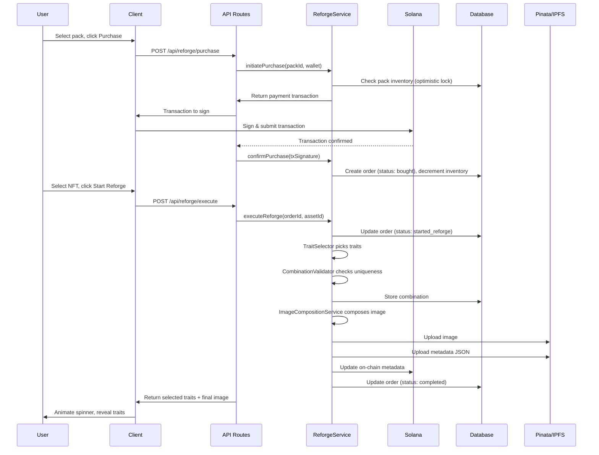

# Design Document: PV Reforge

## Overview

PV Reforge is a pack-based NFT reforging system that extends the existing traitstore application. Users purchase tiered packs (silver, gold, diamond) by paying SOL, select an NFT from their wallet, and the system randomly assembles new traits from a dedicated swap pool within the pack's LDZ earning range. The system composes a new image, updates on-chain metadata, and ensures combination uniqueness — all presented through an animated loot-spinner UI.

The design leverages the existing architecture: Next.js API routes, PostgreSQL via Neon, the repository pattern (`BaseRepository`), existing services (`ImageCompositionService`, `CoreAssetUpdateService`, `PinataUploadService`, `TransactionBuilder`), and Solana wallet integration.

### Key Design Decisions

1. **New tables, no modifications to existing ones** — Reforge uses its own `reforge_packs`, `reforge_orders`, `reforge_combinations` tables. Only nullable columns are added to `traits` and `projects`.
2. **Reuse existing services via composition** — Image composition, Pinata upload, and metadata update are called through their existing public interfaces.
3. **Server-side trait selection before animation** — Traits are selected server-side in one call; the client spinner is purely cosmetic.
4. **Optimistic locking for inventory** — Pack inventory uses `UPDATE ... WHERE remaining_count > 0 RETURNING *` to prevent overselling.
5. **Per-project encrypted Update Authority** — Private keys are AES-256-GCM encrypted at rest, decrypted only at runtime for metadata updates.

## Architecture

```mermaid
graph TD
    subgraph Client
        LP[Landing Page]
        RUI[Reforge UI]
        PROF[Profile Page]
    end

    subgraph API Routes
        PACK_API[/api/reforge/packs]
        PURCHASE_API[/api/reforge/purchase]
        REFORGE_API[/api/reforge/execute]
        ADMIN_API[/api/admin/reforge/*]
    end

    subgraph Services
        RS[ReforgeService]
        TS[TraitSelectorService]
        CV[CombinationValidator]
        ICS[ImageCompositionService]
        PUS[PinataUploadService]
        CAUS[CoreAssetUpdateService]
        TB[TransactionBuilder]
        ENC[EncryptionService]
    end

    subgraph Repositories
        PR[PackRepository]
        ROR[ReforgeOrderRepository]
        CR[CombinationRepository]
        TPR[TraitPoolRepository]
    end

    subgraph Database
        DB[(PostgreSQL / Neon)]
    end

    LP --> PACK_API
    RUI --> REFORGE_API
    PROF --> PACK_API
    RUI --> PURCHASE_API

    PACK_API --> PR
    PURCHASE_API --> RS
    REFORGE_API --> RS
    ADMIN_API --> PR
    ADMIN_API --> TPR

    RS --> TS
    RS --> CV
    RS --> ICS
    RS --> PUS
    RS --> CAUS
    RS --> TB
    RS --> ENC
    RS --> ROR

    TS --> TPR
    CV --> CR

    PR --> DB
    ROR --> DB
    CR --> DB
    TPR --> DB
```

### Request Flow: Pack Purchase + Reforge



## Components and Interfaces

### ReforgeService

The orchestrator for the entire reforge workflow.

```typescript
interface ReforgeService {
  // Purchase flow
  initiatePurchase(packId: string, walletAddress: string, discordId: string): Promise<{ transaction: Transaction; orderId: string }>;
  confirmPurchase(orderId: string, txSignature: string): Promise<ReforgeOrder>;
  
  // Reforge flow
  executeReforge(orderId: string, assetId: string): Promise<ReforgeResult>;
  
  // Queries
  getOrdersByWallet(walletAddress: string): Promise<ReforgeOrder[]>;
  getOrderStatus(orderId: string): Promise<ReforgeOrder>;
}

interface ReforgeResult {
  orderId: string;
  selectedTraits: SelectedTrait[];
  imageUrl: string;
  metadataUrl: string;
  txSignature: string;
}

interface SelectedTrait {
  slotId: string;
  slotName: string;
  traitId: string;
  traitName: string;
  imageUrl: string;
  ldzEarning: number;
}
```

### TraitSelectorService

Handles random trait selection within earning constraints.

```typescript
interface TraitSelectorService {
  selectTraits(
    collectionId: string,
    minLdz: number,
    maxLdz: number
  ): Promise<SelectedTrait[]>;
}
```

**Algorithm:**
1. Load all traits from the swap pool for the collection, grouped by slot.
2. For each mandatory slot, pick a random trait.
3. For optional slots, decide inclusion based on remaining budget.
4. Zero-earning traits are freely included without budget impact.
5. Use backtracking with randomized restarts if initial selection exceeds range.
6. Fail after 100 attempts if no valid combination is found.

### CombinationValidator

```typescript
interface CombinationValidator {
  isUnique(traitIds: string[]): Promise<boolean>;
  recordCombination(orderId: string, traitIds: string[]): Promise<void>;
}
```

Combination uniqueness is checked by hashing the sorted trait IDs and comparing against stored hashes.

### EncryptionService

```typescript
interface EncryptionService {
  encrypt(plaintext: string): string;  // Returns base64(iv + ciphertext + tag)
  decrypt(ciphertext: string): string;
}
```

Uses AES-256-GCM with a server-side key from `ENCRYPTION_KEY` environment variable.

### PackRepository

```typescript
interface PackRepository {
  create(pack: CreatePackInput): Promise<Pack>;
  update(id: string, data: Partial<Pack>): Promise<Pack>;
  findById(id: string): Promise<Pack | null>;
  findByCollection(collectionId: string, activeOnly?: boolean): Promise<Pack[]>;
  decrementInventory(id: string): Promise<Pack | null>; // Optimistic lock
  setEnabled(id: string, enabled: boolean): Promise<Pack>;
}
```

### ReforgeOrderRepository

```typescript
interface ReforgeOrderRepository {
  create(order: CreateOrderInput): Promise<ReforgeOrder>;
  updateStatus(id: string, status: ReforgeOrderStatus, failureReason?: string): Promise<ReforgeOrder>;
  findByWallet(walletAddress: string): Promise<ReforgeOrder[]>;
  findById(id: string): Promise<ReforgeOrder | null>;
  markUsed(id: string, assetId: string): Promise<ReforgeOrder>;
}
```

### TraitPoolRepository

```typescript
interface TraitPoolRepository {
  findByCollection(collectionId: string): Promise<PoolTrait[]>;
  findBySlot(collectionId: string, slotId: string): Promise<PoolTrait[]>;
}
```

### API Routes

| Route | Method | Auth | Description |
|-------|--------|------|-------------|
| `/api/reforge/packs` | GET | None | List active packs for a collection |
| `/api/reforge/purchase` | POST | Wallet + Discord | Initiate pack purchase |
| `/api/reforge/purchase/confirm` | POST | Wallet | Confirm purchase after tx |
| `/api/reforge/execute` | POST | Wallet | Execute reforge on a purchased pack |
| `/api/reforge/orders` | GET | Wallet | Get user's reforge orders |
| `/api/admin/reforge/packs` | GET/POST | Admin | CRUD packs |
| `/api/admin/reforge/packs/[id]` | PUT/DELETE | Admin | Update/delete pack |
| `/api/admin/reforge/traits` | GET/PUT | Admin | Manage swap pool traits |
| `/api/admin/reforge/orders` | GET | Admin | View all orders |

## Data Models

### New Tables

```sql
-- Reforge Packs
CREATE TABLE reforge_packs (
  id UUID PRIMARY KEY DEFAULT gen_random_uuid(),
  collection_id TEXT NOT NULL,
  tier_name TEXT NOT NULL,           -- 'silver', 'gold', 'diamond'
  sol_price NUMERIC(18, 9) NOT NULL, -- Price in SOL
  min_ldz_earning NUMERIC(10, 2) NOT NULL,
  max_ldz_earning NUMERIC(10, 2) NOT NULL,
  total_inventory INTEGER NOT NULL CHECK (total_inventory > 0),
  remaining_count INTEGER NOT NULL CHECK (remaining_count >= 0),
  enabled BOOLEAN NOT NULL DEFAULT true,
  created_at TIMESTAMPTZ NOT NULL DEFAULT NOW(),
  updated_at TIMESTAMPTZ NOT NULL DEFAULT NOW(),
  CONSTRAINT ldz_range_valid CHECK (min_ldz_earning <= max_ldz_earning)
);

-- Reforge Orders
CREATE TABLE reforge_orders (
  id UUID PRIMARY KEY DEFAULT gen_random_uuid(),
  pack_id UUID NOT NULL REFERENCES reforge_packs(id),
  wallet_address TEXT NOT NULL,
  discord_id TEXT NOT NULL,
  asset_id TEXT,                      -- Set when user selects NFT
  status TEXT NOT NULL DEFAULT 'bought'
    CHECK (status IN ('bought', 'started_reforge', 'failed', 'completed')),
  used BOOLEAN NOT NULL DEFAULT false,
  purchase_tx_signature TEXT,
  failure_reason TEXT,
  created_at TIMESTAMPTZ NOT NULL DEFAULT NOW(),
  updated_at TIMESTAMPTZ NOT NULL DEFAULT NOW()
);

-- Reforge Combinations (uniqueness tracking)
CREATE TABLE reforge_combinations (
  id UUID PRIMARY KEY DEFAULT gen_random_uuid(),
  order_id UUID NOT NULL REFERENCES reforge_orders(id),
  collection_id TEXT NOT NULL,
  combination_hash TEXT NOT NULL,     -- SHA-256 of sorted trait IDs
  trait_ids TEXT[] NOT NULL,
  created_at TIMESTAMPTZ NOT NULL DEFAULT NOW(),
  CONSTRAINT unique_combination UNIQUE (collection_id, combination_hash)
);

CREATE INDEX idx_reforge_combinations_hash ON reforge_combinations(collection_id, combination_hash);
CREATE INDEX idx_reforge_orders_wallet ON reforge_orders(wallet_address);
CREATE INDEX idx_reforge_orders_pack ON reforge_orders(pack_id);
CREATE INDEX idx_reforge_packs_collection ON reforge_packs(collection_id);
```

### Modifications to Existing Tables

```sql
-- Add swap pool flag and LDZ earning to traits table
ALTER TABLE traits ADD COLUMN swap_pool_only BOOLEAN DEFAULT false;
ALTER TABLE traits ADD COLUMN ldz_earning NUMERIC(10, 2) DEFAULT 0;

-- Add encrypted update authority to projects table
ALTER TABLE projects ADD COLUMN encrypted_update_authority TEXT;
```

### TypeScript Types

```typescript
type PackTier = 'silver' | 'gold' | 'diamond';
type ReforgeOrderStatus = 'bought' | 'started_reforge' | 'failed' | 'completed';

interface ReforgePack {
  id: string;
  collectionId: string;
  tierName: PackTier;
  solPrice: number;
  minLdzEarning: number;
  maxLdzEarning: number;
  totalInventory: number;
  remainingCount: number;
  enabled: boolean;
  createdAt: string;
  updatedAt: string;
}

interface ReforgeOrder {
  id: string;
  packId: string;
  walletAddress: string;
  discordId: string;
  assetId: string | null;
  status: ReforgeOrderStatus;
  used: boolean;
  purchaseTxSignature: string | null;
  failureReason: string | null;
  createdAt: string;
  updatedAt: string;
}

interface ReforgeCombination {
  id: string;
  orderId: string;
  collectionId: string;
  combinationHash: string;
  traitIds: string[];
  createdAt: string;
}

interface PoolTrait {
  id: string;
  slotId: string;
  slotName: string;
  name: string;
  imageLayerUrl: string;
  ldzEarning: number;
  layerOrder: number;
}
```


## Correctness Properties

*A property is a characteristic or behavior that should hold true across all valid executions of a system — essentially, a formal statement about what the system should do. Properties serve as the bridge between human-readable specifications and machine-verifiable correctness guarantees.*

### Property 1: Pack creation round-trip

*For any* valid pack configuration (with valid tier, positive price, valid LDZ range, positive inventory, and collection ID), creating the pack and then reading it back should produce an equivalent record with all fields preserved.

**Validates: Requirements 1.1**

### Property 2: Pack validation rejects invalid configurations

*For any* pack configuration where `minLdzEarning > maxLdzEarning` OR `totalInventory <= 0`, the Pack_Manager should reject the creation and no pack record should be stored.

**Validates: Requirements 1.2, 1.3**

### Property 3: Disabled packs reject all purchases

*For any* pack that has `enabled = false`, and any valid user with wallet and Discord, a purchase attempt should be rejected and pack inventory should remain unchanged.

**Validates: Requirements 1.7**

### Property 4: Trait pool partitioning

*For any* trait in the system, if `swap_pool_only = true` then the trait appears in the Trait_Pool query results and does NOT appear in the marketplace query results; if `swap_pool_only = false` then the trait appears in the marketplace query results and does NOT appear in the Trait_Pool query results.

**Validates: Requirements 2.2, 2.3, 13.4**

### Property 5: Purchase atomicity

*For any* pack purchase attempt, a Reforge_Order is created and inventory is decremented if and only if the payment transaction is confirmed on-chain. If the transaction fails or is not confirmed, no order exists and inventory is unchanged.

**Validates: Requirements 4.3, 4.4**

### Property 6: Inventory concurrency safety

*For any* pack with `remaining_count = N` and `M` concurrent purchase attempts where `M > N`, at most `N` purchases should succeed and `remaining_count` should never go below zero.

**Validates: Requirements 4.6**

### Property 7: Order state machine validity

*For any* Reforge_Order, the only valid state transitions are: `bought → started_reforge`, `started_reforge → completed`, `started_reforge → failed`, and `bought → failed`. No other transitions should be permitted.

**Validates: Requirements 5.1**

### Property 8: Trait selection validity

*For any* trait pool and pack earning range `[min, max]`, the Trait_Selector output must satisfy: (a) exactly one trait is selected for each mandatory slot (background, skin, eyes, mouth), (b) the sum of LDZ earnings of all selected traits with `ldzEarning > 0` falls within `[min, max]` inclusive, and (c) zero-earning traits do not contribute to the earning sum.

**Validates: Requirements 7.2, 7.3, 7.5**

### Property 9: Combination uniqueness invariant

*For any* two completed reforge orders within the same collection, their combination hashes must be different. Equivalently, no two orders should share the same sorted set of trait IDs.

**Validates: Requirements 8.1, 8.3**

### Property 10: Metadata contains all selected traits

*For any* set of selected traits from a reforge, the generated NFT metadata `attributes` array must contain one entry for each selected trait with the correct `trait_type` (slot name) and `value` (trait name).

**Validates: Requirements 10.1**

### Property 11: Encryption round-trip

*For any* valid private key string, encrypting it with the EncryptionService and then decrypting the result should produce the original key. Additionally, the encrypted form must differ from the plaintext.

**Validates: Requirements 14.2, 10.3**

### Property 12: Order query completeness

*For any* wallet address with N reforge orders, querying orders by that wallet should return exactly N orders, each with correct pack_id, status, and timestamps.

**Validates: Requirements 12.1**

## Error Handling

### Failure Modes and Recovery

| Failure Point | Detection | Recovery | Order State |
|---------------|-----------|----------|-------------|
| Payment tx fails | Solana tx status check | No order created, user can retry | N/A |
| Payment confirmed but DB write fails | Transaction wrapper rollback | Retry DB write; if persistent, manual reconciliation | N/A |
| Trait selection exhausted | Attempt counter reaches 100 | Order → `failed`, user notified, pack remains "used" | `failed` |
| Combination uniqueness exhausted | Attempt counter reaches 50 | Order → `failed`, user notified | `failed` |
| Image composition fails | Exception from Sharp/fetch | Order → `failed`, log error, user can contact support | `failed` |
| Pinata upload fails | HTTP error response | Retry up to 3 times, then order → `failed` | `failed` |
| Metadata update tx fails | Solana tx status check | Retry up to 3 times, then order → `failed` | `failed` |
| Concurrent inventory race | `UPDATE RETURNING` returns 0 rows | Return "sold out" to user | N/A |

### Error Response Format

All API errors follow a consistent format:

```typescript
interface ReforgeError {
  error: string;        // Machine-readable error code
  message: string;      // Human-readable message
  orderId?: string;     // If applicable
  retryable: boolean;   // Whether the client should retry
}
```

Error codes:
- `PACK_SOLD_OUT` — Inventory exhausted
- `PACK_DISABLED` — Pack not available
- `AUTH_REQUIRED` — Missing wallet or Discord
- `INVALID_ORDER_STATE` — Invalid state transition attempted
- `TRAIT_SELECTION_FAILED` — Could not find valid combination
- `COMBINATION_EXHAUSTED` — All unique combinations used
- `IMAGE_COMPOSITION_FAILED` — Image assembly error
- `METADATA_UPDATE_FAILED` — On-chain update failed after retries
- `ENCRYPTION_ERROR` — Key encryption/decryption failure

### Idempotency

- Purchase confirmation is idempotent: confirming the same tx signature twice returns the existing order.
- Reforge execution is NOT idempotent: each call creates a new attempt. The `used` flag prevents double-execution.

## Testing Strategy

### Property-Based Tests (fast-check + Jest)

The project already has `fast-check` (v3.19.0) and `jest` (v29.7.0) configured. Each correctness property maps to a single property-based test with minimum 100 iterations.

**Test file structure:**
```
tests/
  reforge/
    trait-selector.property.test.ts    — Properties 8
    combination-validator.property.test.ts — Property 9
    pack-validation.property.test.ts   — Properties 1, 2, 3
    trait-pool-partitioning.property.test.ts — Property 4
    encryption.property.test.ts        — Property 11
    metadata-builder.property.test.ts  — Property 10
    order-state-machine.property.test.ts — Property 7
    inventory-concurrency.property.test.ts — Property 6
    purchase-atomicity.property.test.ts — Property 5
    order-query.property.test.ts       — Property 12
```

**Tag format:** Each test is tagged with a comment:
```typescript
// Feature: pv-reforge, Property 8: Trait selection validity
```

**Configuration:** Each property test runs with `{ numRuns: 100 }` minimum.

### Unit Tests (Jest)

Unit tests cover specific examples, edge cases, and error conditions:

- Pack CRUD operations (create, read, update, enable/disable)
- Order state transitions (valid and invalid)
- Trait selection edge cases (empty pool, single trait, all zero-earning)
- Combination hash generation consistency
- Encryption with various key formats
- API route authentication checks
- Error response formatting

### Integration Tests

- End-to-end purchase flow with mocked Solana
- Reforge execution with mocked external services (Pinata, Solana)
- Concurrent purchase stress test
- Database migration verification

### What Is NOT Property-Tested

- UI animations and visual styling (Requirements 3.3–3.5, 11.1–11.8)
- Solana transaction building (integration with external service)
- Pinata uploads (external service)
- Real-time count updates (WebSocket/polling behavior)
- Backward compatibility (architectural constraint, verified by existing test suite)
